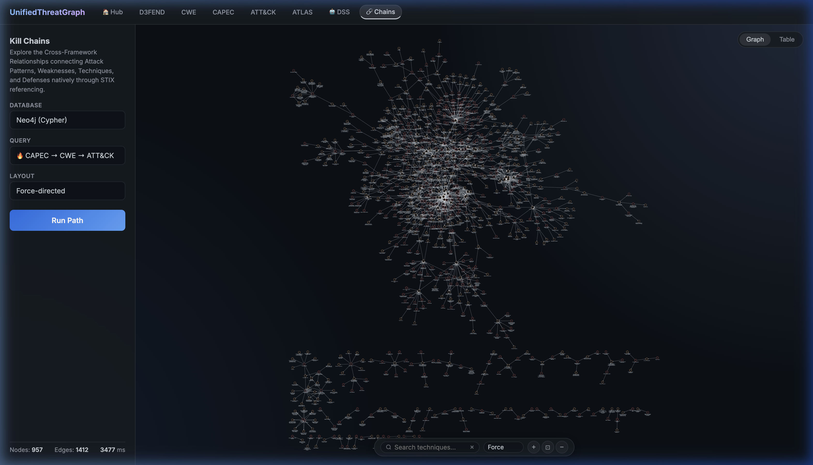
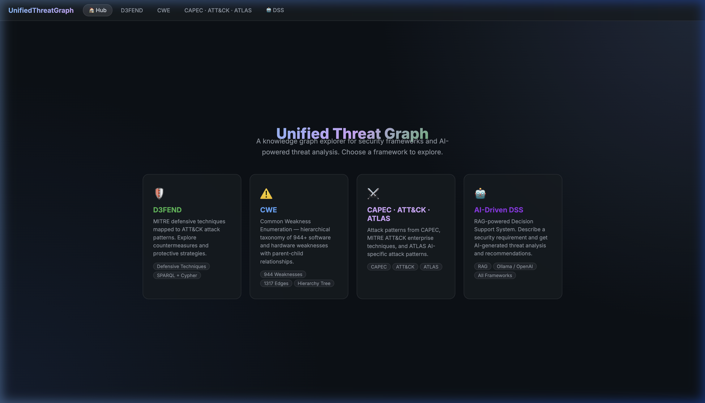
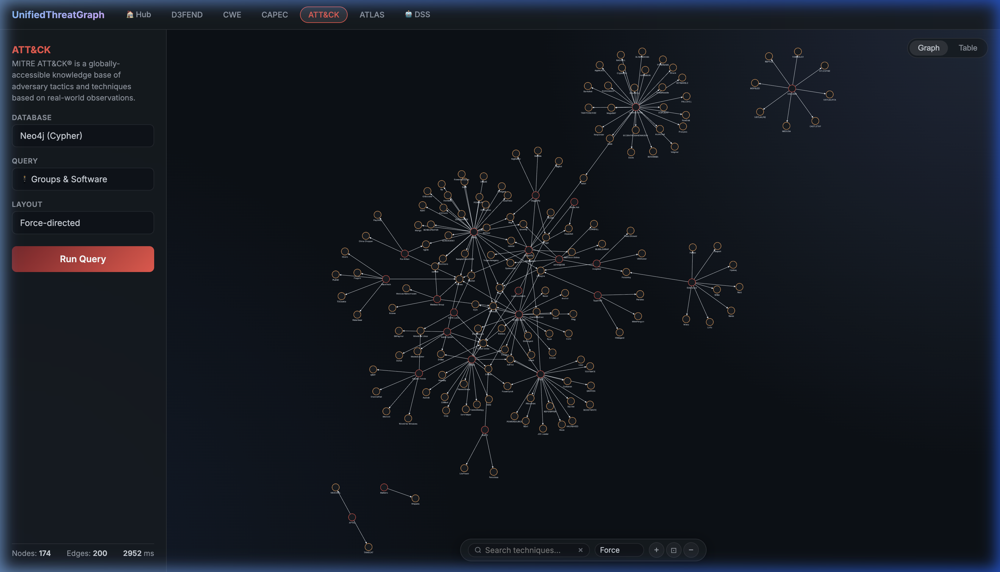
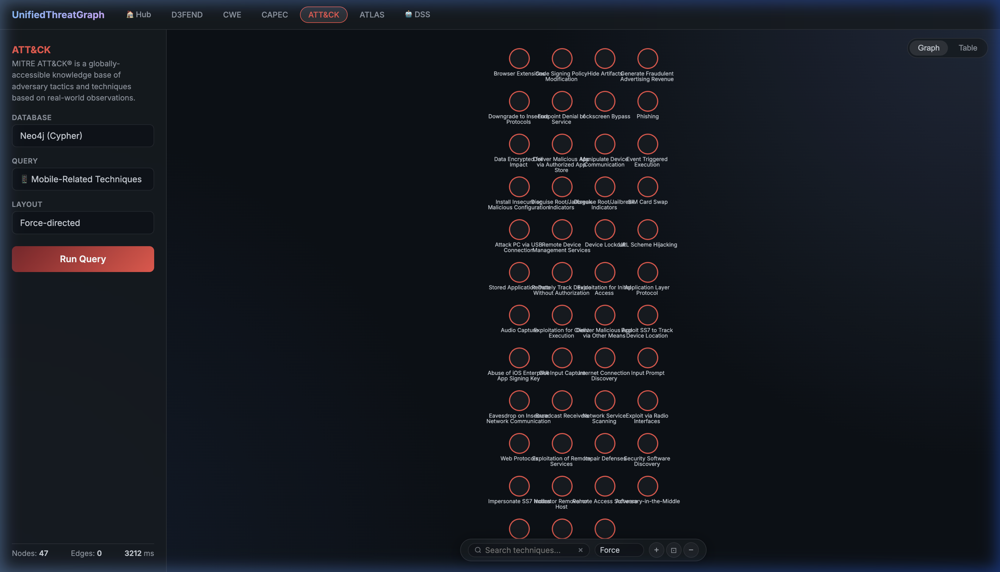

# UnifiedThreatGraph Test Environment

> **Aggregating CAPEC, CWE, MITRE ATT&CK, ATLAS & D3FEND**
> **Phase 1 of 2** — SPARQL/GraphDB evaluation.

This project integrates multiple MITRE security frameworks into a single GraphDB (RDF) knowledge base and provides a visualization dashboard to explore them.

## Screenshots

Here are some examples of the framework visualizations provided by the unified dashboard:

### Multi-Framework Kill Chains

*Visualizing a multi-framework Kill Chain mapping Attack Patterns (CAPEC, Purple) to Weaknesses (CWE, Red) and ultimately the adversarial Techniques (ATT&CK, Blue).*

### Framework Overviews

*Unified Hub with easy navigation to individual framework cards.*

### Deep ATT&CK Queries

*Visualizing Threat Actor Groups and the Malware/Tools they employ.*


*Visualizing Mobile-specific (Android/iOS) Techniques.*


## Prerequisites

- **Docker + Docker Compose**: installed and running (e.g., Docker Desktop on Mac/Windows).
- **Internet access**: necessary for the initializer container to download the D3FEND ontology and the STIX/JSON datasets on first boot.

*(Note: Node.js and Python are no longer required on the host machine as the entire stack is fully containerized).*

---

## Deployment (Automated Setup)

This project uses a 5-container architecture to run out-of-the-box on any system:
1. `graphdb`: Ontotext GraphDB
2. `neo4j`: Neo4j Community Edition
3. `api-backend`: Node.js API server
4. `web-frontend`: Nginx static web server
5. `data-initializer`: A transient Python container that handles all data ingestion.

To start the application:

```bash
docker compose up -d --build
```

### What happens next? (The Data Initializer)
Because the databases start empty on a fresh machine, the `data-initializer` container automatically wakes up, waits for the databases to be healthy, and does all the heavy lifting:
- Uses the GraphDB REST API to create the repository and upload D3FEND.
- Downloads the latest STIX JSON datasets (CWE, CAPEC, ATT&CK Enterprise/Mobile, ATLAS).
- Injects all STIX data into Neo4j and GraphDB.

**Monitor the setup progress:**
```bash
docker compose logs -f data-initializer
```
*Wait until you see:* `[INFO] Initialization completely finished! Container will now exit gracefully.`

### Accessing the Application

Once the initializer finishes, the dashboard is ready to use:

- **Visualizer Dashboard**: [http://localhost:8001](http://localhost:8001)
- **Backend API**: [http://localhost:3000](http://localhost:3000)
- **GraphDB Workbench**: [http://localhost:7200](http://localhost:7200) (SPARQL endpoint is at `/repositories/d3fend`)
- **Neo4j Browser**: [http://localhost:7474](http://localhost:7474)

---

## Step 4 — Run the Query Suite

Now that the GraphDB repository is populated with all frameworks, you can test the SPARQL queries.

```bash
# Activate python env (if not already activated)
source venv/bin/activate

# Run all predefined queries
python3 run_queries.py

# Run only secondary framework queries (CAPEC, CWE, ATLAS)
python3 run_queries.py --query secondary_frameworks

# Run only cross-framework queries
python3 run_queries.py --query cross_framework

# Run an interactive keyword search across D3FEND
python3 run_queries.py --search "ransomware"
```

---

## Query Reference

| Query ID | What it answers |
|---|---|
| `Q1_all_attack_to_d3fend` | Full ATT&CK ↔ D3FEND mapping table |
| `Q2_credential_attacks` | Countermeasures for credential-based attacks |
| `Q3_data_exfil_attacks` | Countermeasures for data exfiltration |
| `Q4_tactic_overview` | Technique count per D3FEND tactic (Harden/Detect/etc.) |
| `Q5_harden_techniques` | All "Harden" techniques (maps to GDPR Art.32 / CRA) |
| `Q6_detect_techniques` | All "Detect" techniques |
| `Q7_coverage_priority` | Top controls ranked by ATT&CK coverage breadth |
| `Q8_data_protection` | Encryption, access control, auth techniques |
| `Q9-Q11` | Overviews of CWE, CAPEC, and ATLAS |
| `Q12_injection_across_frameworks` | Cross-framework search for "injection" related vulnerabilities/patterns |
| `Q13_phishing_across_frameworks` | Cross-framework search for "phishing" related vulnerabilities/patterns |

---

## Explore the GraphDB Workbench

Open your browser at **http://localhost:7200**.
- Go to **Repositories** → confirm `d3fend` exists.
- Go to **SPARQL** to write custom queries directly against the knowledge graph.

### Troubleshooting

- **GraphDB doesn't start:** Run `docker compose logs graphdb` (usually a port 7200 conflict).
- **Import fails / stops:** Ensure your `config.ttl` is updated for GraphDB 10.6.0 (removing FreeSail references).
- **No results from queries in GraphDB:** Check the GraphDB repository triple count using `SELECT (COUNT(*) as ?c) WHERE { ?s ?p ?o }`. Note that some queries expect the `d3fend` name to be exact due to graph bindings. 

---

## What's Next (Phase 2 — Neo4j)

We have already set up a Neo4j container in the `docker-compose.yml`.
1. Use **neosemantics (n10s)** to analyze the GraphDB loaded STIX objects.
2. Write equivalent Cypher queries for the property graph.
3. Compare SPARQL and Cypher approaches.
